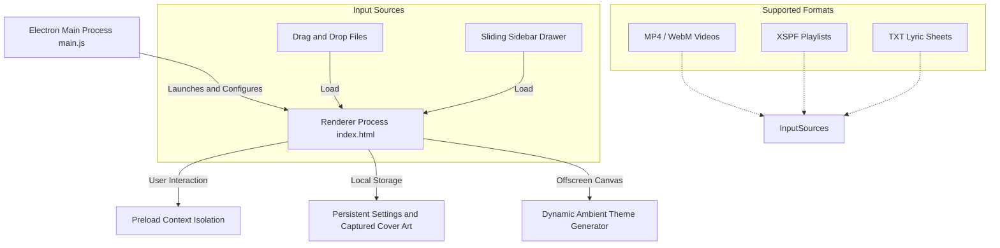

# MAPL Player (Mp4 Audio PLayback)

MAPL Player is a clean, feature-rich Electron-based media player designed for playing MP4/WebM videos as audio-focused media tracks or native videos. It includes dynamic color matching, custom cover-art capture, XSPF playlist parsing, and text lyrics loading.

---

## Key Features

*   **Dual Audio / Video Playback Modes**
    *   **Audio Mode:** Hides the video stream and displays album/cover art with dynamic ambient color extraction.
    *   **Video Mode:** Renders the native video inside the player with standard video controls.
*   **Dynamic Ambient Color Matching**
    *   Draws the active video frame or thumbnail to an offscreen canvas to analyze pixel data and extract average RGB values.
    *   Smoothly transitions the player container and background colors to blend with the album art or video content.
*   **Custom Frame and Thumbnail Capture**
    *   Allows pausing the video on any frame to capture a snapshot.
    *   Saves the snapshot persistently as custom cover-art linked to that media's URL.
*   **Playlist Handling and XSPF Parsing**
    *   Loads single files or XML-based XSPF playlists.
    *   Features a search filter to instantly find and queue tracks in long playlists.
*   **Integrated Lyrics Reader**
    *   Loads plain text files to display lyrics alongside your active track.
*   **Volume Control and Persistent Settings**
    *   Pop-out volume control slider that appears on hover.
    *   Saves loop status, volume, and custom thumbnails to localStorage to persist across application restarts.
*   **Drag-and-Drop Loader**
    *   Enables loading media files, XSPF playlists, or plain text lyric sheets by dragging them directly onto the player window.

---

## Tech Stack and Architecture



### Main Stack Components
*   **Runtime Framework:** Electron for building cross-platform desktop applications.
*   **UI and Layout Styling:** Tailwind CSS and custom Vanilla CSS animations.
*   **Typography:** Google Inter font family.
*   **Core Engine:** HTML5 Media Elements API (Video, Canvas, Web Audio capabilities) with vanilla JavaScript ES6.

---

## Getting Started

### Prerequisites
Make sure you have Node.js and npm installed.

### Installation
1. Clone this repository to your local machine:
   ```bash
   git clone <repository-url>
   cd mapl-player-app
   ```
2. Install dependencies:
   ```bash
   npm install
   ```

### Running the Application
Launch the Electron desktop application locally:
```bash
npm start
```

---

## How to Use

### 1. Loading Media
*   **Option A:** Click the **Open Files** button in the left panel to open the sidebar drawer and select a media file (MP4/WebM), an XSPF playlist, or a text file for lyrics.
*   **Option B:** Drag and drop any supported file directly onto the player window.

### 2. Controlling Playback
*   Use the round center button for **Play/Pause**, and the flanking buttons to jump to the **Previous** or **Next** track.
*   Toggle the circular arrow button on the top-right to enable or disable **Playlist Looping**.
*   Hover over the speaker icon in the top-right to reveal the volume slider and adjust levels.

### 3. Capturing Custom Thumbnails
1. Switch to **Video** mode using the bottom toggle.
2. Play the video and pause at the desired frame.
3. Click the **Capture** button in the left panel.
4. The captured snapshot will now serve as the cover art whenever you play this track in **Audio** mode.

### 4. Navigating Playlists
*   Switch to the **Playlist** view in the left sidebar.
*   Use the filter box to search for tracks by name.
*   Click any track in the list to play it directly.

---

## Key Configurations and Security

*   **Security Sandboxing (`main.js`):**
    *   Implements nodeIntegration: false, contextIsolation: true, and enableRemoteModule: false.
    *   Configures webSecurity: false to allow playing local media and playlist resources. Ensure appropriate resource authorization if connecting to external remote streams.

---

## Roadmap and Migration

> [!NOTE]
> **Native Migration Phase:** While this JavaScript and Electron codebase represents a highly functional desktop web baseline, the project has an official roadmap to migrate to **C++ and QML (using the Qt framework)**.
>
> The transition aims to leverage native GPU acceleration, reduce memory footprint, and achieve even smoother OS-level UI integration while maintaining the signature MAPL styling and high-performance playback capabilities.

---

## License
This project is licensed under the MIT License. See the LICENSE file for details.
