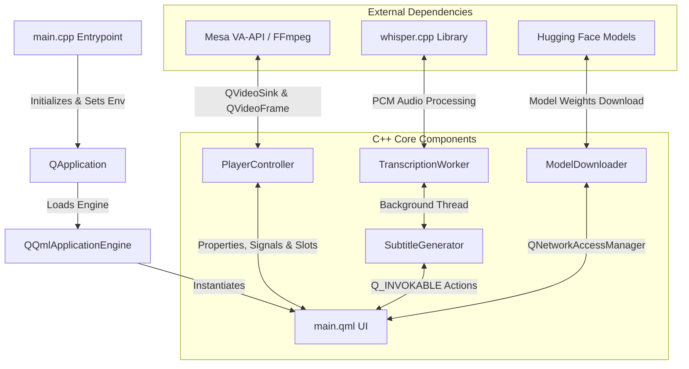

# MAPL Player (Native C++ & Qt6 Version)

MAPL Player is a high-performance, native C++ desktop media player built for **Fedora Linux (KDE)** and other modern Linux distributions using **Qt6 (Qt Quick / QML)**. It features dynamic background color extraction, cover-art snapshots, a custom subtitles customizer, and a built-in local speech-to-text subtitle generator powered by **OpenAI Whisper** via `whisper.cpp`.

---

## 🏗️ System Architecture

The native version of MAPL Player divides responsibilities between a C++ backend (for heavy computing, file I/O, networking, and performance-critical operations) and a fluid QML frontend (for user interface rendering and input handling).



---

## 📂 Codebase & Component Reference

### 1. `main.cpp`
The entrypoint of the application. It configures the runtime environment and initializes the Qt Quick engine:
*   **VA-API Pre-configuration**: Automatically executes `qputenv("QT_FFMPEG_DECODING_HW_DEVICE_TYPES", "vaapi")` to force the Qt Multimedia FFmpeg backend to utilize hardware-accelerated video decoding (such as Intel/AMD VA-API) by default.
*   **Local File Access Support**: Enables `QML_XHR_ALLOW_FILE_READ` to allow QML's `XMLHttpRequest` to parse local XSPF playlists.
*   **Startup Engine Loading**: Connects signals to verify successful loading of `main.qml`.

### 2. `PlayerController`
Exposed as a QML element (`PlayerController`), this class handles persistent settings, file operations, and active frame analysis:
*   **Properties**:
    *   `videoSink` ([QVideoSink](file:///home/kaveen/projects/MAPL-Player/native/PlayerController.h#L17)): Hooked into QML's `VideoOutput` to receive video frames.
    *   `currentTrackTitle` ([QString](file:///home/kaveen/projects/MAPL-Player/native/PlayerController.h#L18)): Title of the active media file.
*   **Dynamic Background Extraction**:
    *   Intercepts frames inside `handleVideoFrame()`.
    *   Samples pixel colors at regular intervals (50ms throttle) to calculate the average RGB values.
    *   Emits `backgroundColorChanged(hexColor)` to smoothly transition the QML player's ambient glassmorphic background colors.
*   **Persistence & I/O Helpers**:
    *   `saveVolume()` / `loadVolume()` and `saveLoop()` / `loadLoop()` using `QSettings`.
    *   `captureThumbnail(trackUrl)`: Extracts the current video frame from `QVideoSink` and saves it locally as a PNG thumbnail linked to the media track.
    *   `writeTextToFile(filePath, content)`: Exports transcripts/subtitles to a `.txt` file.

### 3. `SubtitleGenerator` & `TranscriptionWorker`
Manages offline speech-to-text generation:
*   **Background Threading**: Spawns a `TranscriptionWorker` inside a `QThread` to prevent blocking the QML GUI thread during CPU-intensive transcriptions.
*   **Audio Extraction**: Uses `QProcess` to run `ffmpeg` locally, demuxing the audio stream and converting it to the required format (16kHz, single-channel, 16-bit PCM WAV).
*   **Whisper Inference**: Connects to the compiled C API of `whisper.cpp` to feed the raw PCM samples into the selected model. It reports transcription progress via a static progress callback and emits `subtitlesReady()` with a detailed list of text segments containing start and end timestamps.

### 4. `ModelDownloader`
Handles thread-safe downloading of OpenAI Whisper models:
*   **Functions**:
    *   `checkModelExists(modelName)`: Checks local cache folder (`~/.cache/mapl-player/`).
    *   `startDownload(modelName)`: Pulls the `.bin` weights model from Hugging Face Repository.
    *   `cancelDownload()`: Aborts ongoing network requests safely.
*   **Network Engine**: Implements `QNetworkAccessManager` with progress tracking to display download percentages directly in the QML UI.

### 5. `main.qml`
The complete GUI declaration:
*   **Layout Architecture**: A horizontal `RowLayout` splitting the UI into a **Left Sidebar panel** and a **Main Content Wrapper**.
*   **Views Container**: Uses an `Item` displaying views based on the `currentView` property:
    *   `audio`: Immersive view with blurred album art backgrounds, a live subtitle card, and an "Up Next" queue panel.
    *   `video`: Inline native video player displaying video output and floating subtitle overlays.
    *   `lyrics`: Dedicated subtitles customizer and transcript panel.
    *   `playlist`: Filterable media queue list.
*   **Controls Panel**: Standard bottom controls containing responsive timelines, skipping controls, volume sliders, looping toggles, and status/error indicators.

---

## 🛠️ Build & Installation Guide

### 1. Install System Dependencies
First, install the compiler, build tools, Qt6 SDK, and FFmpeg development files.

**On Fedora Linux:**
```bash
sudo dnf install cmake gcc-c++ qt6-qtbase-devel qt6-qtdeclarative-devel qt6-qtmultimedia-devel ffmpeg ffmpeg-devel libva-utils
```

**On Ubuntu / Debian:**
```bash
sudo apt install cmake g++ qt6-base-dev qt6-declarative-dev qt6-multimedia-dev libqt6multimedia6 ffmpeg libva-dev vainfo
```

### 2. Compile the Project
Configure and compile the native binary (CMake will automatically retrieve `whisper.cpp` v1.8.6 as a dependency):

```bash
cd native
mkdir build && cd build
cmake .. -DCMAKE_BUILD_TYPE=Release
make -j$(nproc)
```

This creates the native executable: `./mapl-player`.

---

## 🚀 Running the Application

Launch the compiled executable directly from the build folder:
```bash
./mapl-player
```

### Initial Model Setup (For Subtitles)
The first time you generate subtitles, the app prompts you to download a Whisper model file:
*   **Tiny Model (~77 MB):** Fast, low CPU/RAM footprint.
*   **Base Model (~140 MB):** Higher accuracy, better handling of noise and accents.

Models are saved to `~/.cache/mapl-player/`. Once downloaded, you can disable internet access; subtitle generation runs 100% locally and offline.

---

## ⚡ Hardware Video Acceleration (GPU decoding)

To reduce CPU usage and utilize your GPU for video decoding (e.g. Intel/AMD Radeon):

1.  **Verify VA-API status on your machine**:
    Run `vainfo` in your terminal. You should see `va_openDriver() returns 0` and supported codecs listed (e.g., `VAProfileH264High : VAEntrypointVLD`).
    *   On Fedora, ensure you have enabled the RPM Fusion repositories and installed `mesa-va-drivers-freeworld` to get patent-restricted H.264/H.265 GPU decoding.
2.  **Display Protocol Issues**:
    The application defaults to native Wayland windowing. In some desktop configurations, FFmpeg's VA-API backend struggles with Wayland display context initialization. If you see VA-API initialization errors, force the player to run via **XWayland** by setting the QPA platform flag:
    ```bash
    QT_QPA_PLATFORM=xcb ./mapl-player
    ```

---

## ⌨️ Global Shortcuts

*   **Space**: Play / Pause
*   **Left Arrow / Right Arrow**: Seek backward / forward 5 seconds
*   **F / Double Click (Video)**: Toggle Fullscreen
*   **M**: Toggle Mute
*   **Escape**: Exit Fullscreen
